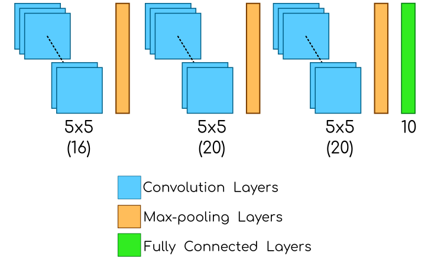
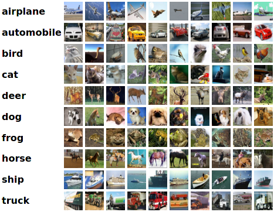
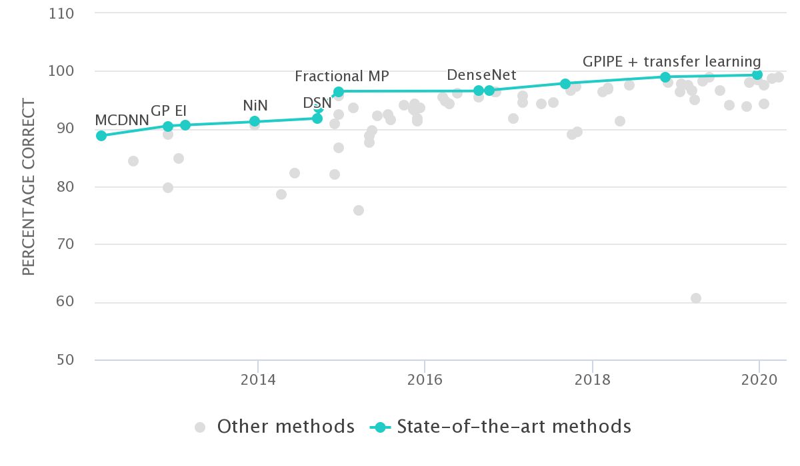
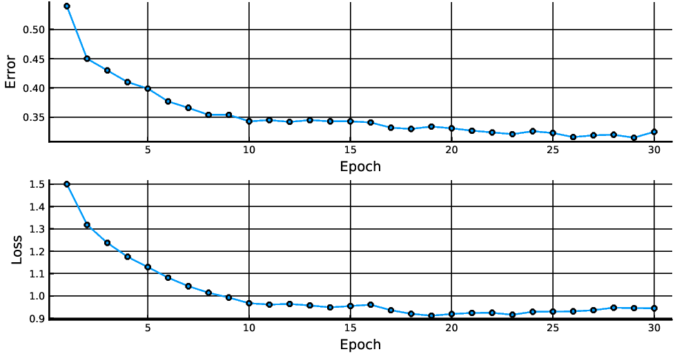
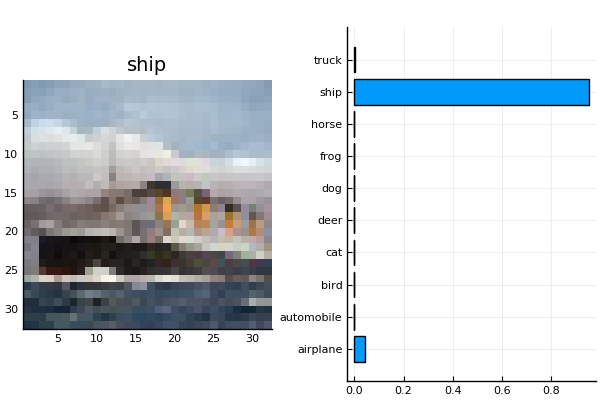
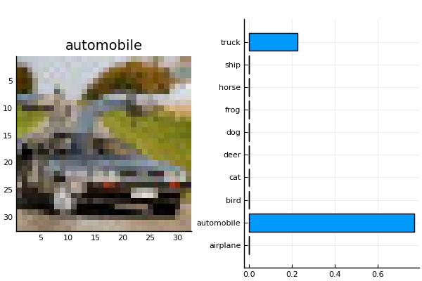
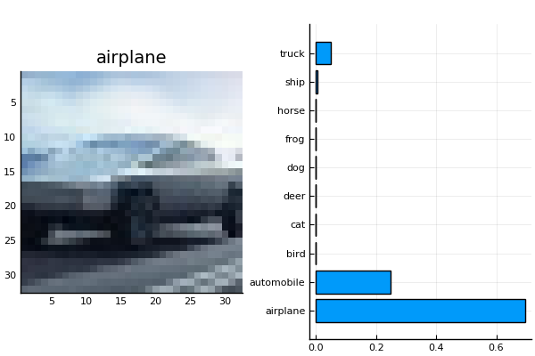
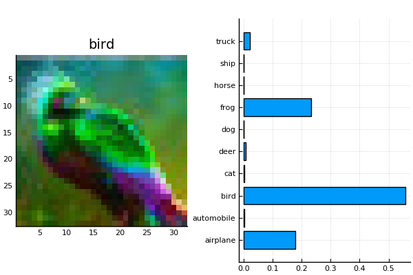

 


# Introduction

This project is focused on the implementation of a given Convolutional Neural Network (CNN) to classify $32 \times 32$ RGB images. That CNN uses three convolutional layers with RELU activation functions, three Pool layers and one fully connected layer activated by a softmax function. Such CNN is part of an [online demo](https://cs.stanford.edu/people/karpathy/convnetjs/demo/cifar10.html) and it is described in Figure @fig:cnn. 

{ width=90% #fig:cnn}

The optimization method to train this CNN is called [ADAMW](https://arxiv.org/abs/1711.05101) which is a variant of [ADAM](https://arxiv.org/abs/1412.6980v8) defined by fixing weight decay regularization. The [crossentropy loss function](https://research.google/pubs/pub38136.pdf) was considered here.

The following section is focused on describing the dataset to train the CNN described above.

## Dataset

The dataset used here is the [CIFAR-10](https://www.cs.toronto.edu/~kriz/cifar.html) dataset that consists of 60000 color images ($32 \times 32$) in 10 classes, with 6000 images per class. There are 50000 training images and 10000 test images (see Figure @fig:cifar).


{ width=50%  #fig:cifar}

Different CNNs have been proposed to improve the learning rate on that dataset (see Figure @fig:chart). Actually, the best algorithm is called Big Transfer (BiT): General Visual Representation Learning with 99.3% accuracy. 

{ width=90% #fig:chart }

# Implementation

The provided CNN was implemented in the [Julia Programming Language](https://julialang.org/) since it is open-source software and provides an extendible  library for machine learning called [Flux](https://fluxml.ai). The implementation of the CNN described before  is as follows:

```julia
testCNN() = Chain(
  Conv((5, 5), 3 => 16, relu, pad=(2, 2), stride=(1, 1)),
  MaxPool((2,2), stride=(2, 2)),
  Conv((5, 5), 16 => 20, relu, pad=(2, 2), stride=(1, 1)),
  MaxPool((2,2), stride=(2, 2)),
  Conv((5, 5), 20 => 20, relu, pad=(2, 2), stride=(1, 1)),
  MaxPool((2,2), stride=(2, 2)),
  x -> reshape(x, :, size(x, 4)),
  Dense(320, 10),
  softmax 
)
```

In this work 60000 was divided into 50000 for training and 10000 for testing and the remaining 10000 images were used to validate the model. All experiments ran in a laptop with an AMD Ryzen 5 3500u $\times$ 8 processor and 12GB RAM.

{ width=90%  #fig:conver}

Figure @fig:conver shows information about the convergence of the proposed methodology. 
The accuracy obtained on the validation set was 70% in 30 epochs. The [source code](https://github.com/jmejia8/cnn-projects) is available in order to you can replicate those results.

# Experiments on Dummy Images

Different images were downloaded from the internet and classified, the results are showed in following Figures @fig:titanic - @fig:bird. Such figures plots the image and  the probability for each class. 


{ width=80% #fig:titanic}

{ width=80% #fig:delorean}


{ width=80% #fig:cyber}

{ width=80% #fig:bird}


