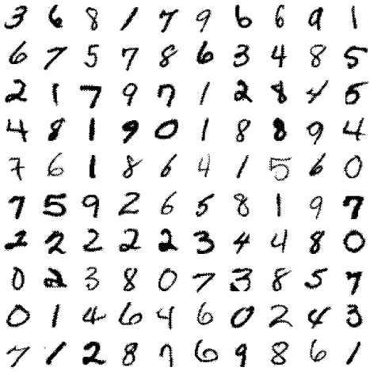

 


# Introduction

This project is focused on the implementation of the [LeNet5](https://doi.org/10.1109/5.726791) Neural Network to classify $28 \times 28$ handwritten digits. LeNet5 uses two convolutional layers with RELU activation functions, two Pool layers and three fully connected layers also activated by RELU functions as showed in Figure @fig:cnn . 

{ width=90% #fig:cnn}


The optimization method to train this CNN was the well-known optimization method called [ADAM](https://arxiv.org/abs/1412.6980v8), it learning rate was fixed to $\eta =3\times10^{-4}$ and the [logit-crossentropy loss function](https://research.google/pubs/pub38136.pdf) was considered here.

The following section is focused on describing the dataset to train LeNet5.

## Dataset

The dataset used here is the [MNIST](http://yann.lecun.com/exdb/mnist/) dataset that consists of 70000 gray scale images ($28 \times 28$) in 10 classes (handwritten digits), with 6000 images per class in the training dataset. There are 60000 training images and 10000 test images (see Figure @fig:mnist).


{ width=80%  #fig:mnist}

Different CNNs have been proposed to improve the learning rate on that dataset. Actually,  one of best algorithm is a [Multi-column Deep Neural Network](https://arxiv.org/abs/1202.2745) with 99.77% accuracy. 


# Implementation

LeNet5 was implemented in the [Julia Programming Language](https://julialang.org/) since it is open-source software and provides an extendible  library for machine learning called [Flux](https://fluxml.ai). The implementation of the CNN described before  is as follows:

```julia
Chain(
	x -> reshape(x, imgsize..., :),
	Conv((5, 5), imgsize[end]=>6, relu),
	MaxPool((2, 2)),
	Conv((5, 5), 6=>16, relu),
	MaxPool((2, 2)),
	x -> reshape(x, :, size(x, 4)),
	Dense(prod(out_conv_size), 120, relu), 
	Dense(120, 84, relu), 
	Dense(84, nclasses)
)
```

In this work 70000 instances were divided into 60000 for training and 10000 for testing and to validate the model. All experiments ran in a laptop with an AMD Ryzen 5 3500u $\times$ 8 processor and 12GB RAM.

{ width=99%  #fig:conver}

Note that, Figure @fig:conver shows information about the convergence of the LeNet5. 
The accuracy obtained on the validation set was 90% in 20 epochs. The [source code](https://github.com/jmejia8/cnn-projects) is available in order to you can replicate those results. Figure @fig:egs shows some instances and its predicted digit.


{ width=80% #fig:egs}


