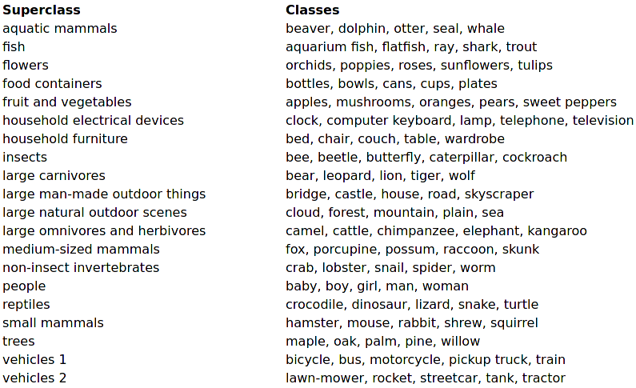
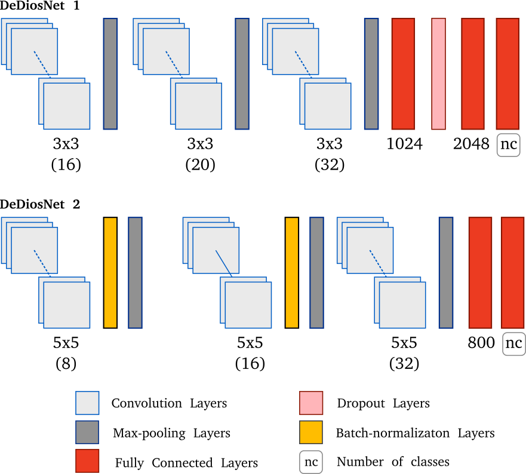
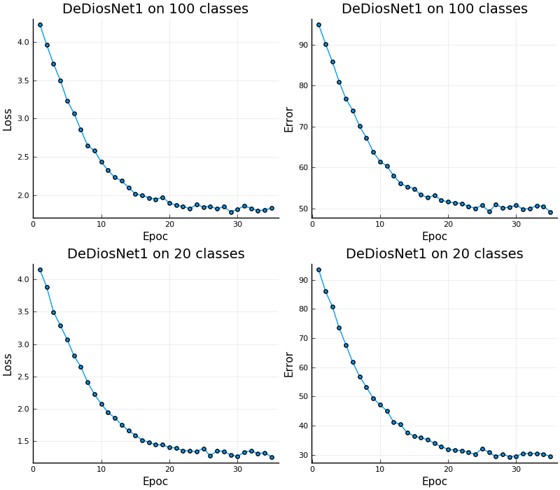
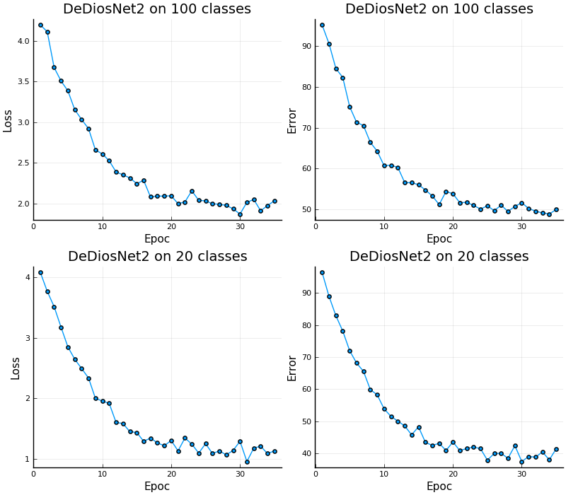
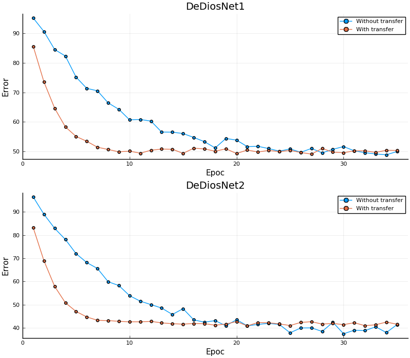

# Introduction

This project is focused on the design and implementation of two Convolutional  Neural Networks (CNNs)  to study the knoledge transfer concept on CNNs. Here,  convolutional layers with RELU activation functions, Pooling  and  fully connected layers are considered.

The optimization method to train this CNN was the well-known optimization method called [ADAM](https://arxiv.org/abs/1412.6980v8), with learning rate fixed to $\eta =3\times10^{-4}$ and the [logit-crossentropy loss function](https://research.google/pubs/pub38136.pdf) is considered here. The following section is focused on describing the dataset to perform different experiments.

{ width=90%  #fig:cifar}

## Dataset


The database used here is the [CIFAR-100](https://www.cs.toronto.edu/~kriz/cifar.html) dataset that consists of 60000 color images ($32 \times 32$) in 100 classes, with 1000 images per class. There are 50000 training images and 10000 test images (see Figure @fig:cifar).   The 100 classes in the CIFAR-100 are grouped into 20 superclasses. Each image comes with a "fine" label (the class to which it belongs) and a "coarse" label (the superclass to which it belongs).


Different CNNs have been proposed to improve the learning rate on that dataset. Actually,  one of best algorithm is a [Fast and Accurate Deep Network Learning by Exponential Linear Units](http://arxiv.org/abs/1511.07289) with 75.72% accuracy.

# Desing

{ width=95% #fig:cnn}

Here, LeNet5 and VGG19 were considered as inspiration to design two CNNs called DeDiosNet 1 and DeDiosNet 2. Figure @fig:cnn describes those networks. It worth noting that DeDiosNet1 uses three small convolutional masks ($3\times 3$) as in VGG19 in order to keep low number of parameters but using the same optimizer and loss function as in LeNet5. On the other hand,  DeDiosNet 2 uses $5\times 5$ kernels before  batch normalization  and MaxPooling leyers as in VGG19.
Moreover, DeDiosNet1 uses 3133464 parameters whilst DeDiosNet2 uses 96820 parameters.


# Implementation

DeDiosNet 1 and DeDiosNet 2 was implemented in the [Julia Programming Language](https://julialang.org/) since it is open-source software and provides an extensible  library for machine learning called [Flux](https://fluxml.ai). The implementation of the CNNs described before  are as follows:


```julia
DeDiosNet1 = Chain(
	Conv((3, 3), 3 => 16, relu, pad=(2, 2), stride=(1, 1)),
	MaxPool((2,2), stride=(2, 2)),
	Conv((3, 3), 16 => 20, relu, pad=(2, 2), stride=(1, 1)),
	MaxPool((2,2), stride=(2, 2)),
	Conv((3, 3), 20 => 32, relu, pad=(2, 2), stride=(1, 1)),
	MaxPool((2,2), stride=(2, 2)),
	x -> reshape(x, :, size(x, 4)),
	Dense(800, 1024),
	Dense(1024, 2048),
	Dropout(0.5),
	Dense(2048, nclasses),
	softmax)
```


```julia
DeDiosNet2 = Chain(
	Conv((5, 5), 3 => 8, relu, pad=(2, 2), stride=(1, 1)),
	BatchNorm(16),
	MaxPool((2,2), stride=(2, 2)),
	Conv((5, 5), 8 => 16, relu, pad=(2, 2), stride=(1, 1)),
	BatchNorm(16),
	MaxPool((2,2), stride=(2, 2)),
	Conv((5, 5), 16 => 32, relu, pad=(2, 2), stride=(1, 1)),
	MaxPool((2,2), stride=(2, 2)),
	x -> reshape(x, :, size(x, 4)),
	Dense(800, nclasses),
	softmax)
```


In this work 60000 instances were divided into 50000 for training and 10000 for testing and to validate the models. All experiments ran in a laptop with an AMD Ryzen 5 3500u $\times$ 8 processor and 12GB RAM.


Figures @fig:conva and @fig:convb shows information about the convergence of the DeDiosNet 1  and DeDiosNet 2, respectively.
The accuracy obtained on the validation set for 100 classes was 50% (DeDiosNet1) and 59% (DeDiosNet2) in 35 epochs. The [source code](https://github.com/jmejia8/cnn-projects) is available in order to you can replicate those results.

{ width=99%  #fig:conva}


{ width=99%  #fig:convb}


## Transfer Learning

Figure @fig:gg shows how the transfer learning impact the convergence velocity. It can be noted that the knowledge transfer allows rapid convergence
however it can induce that the optimization method finds a local optima.


{ width=99%  #fig:gg}
