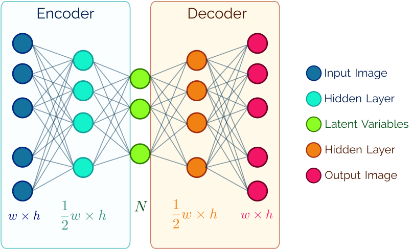
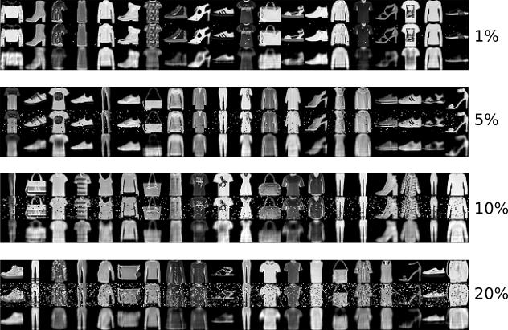
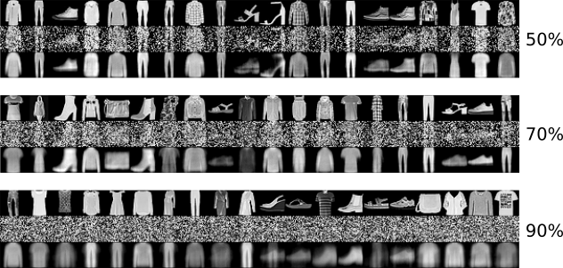
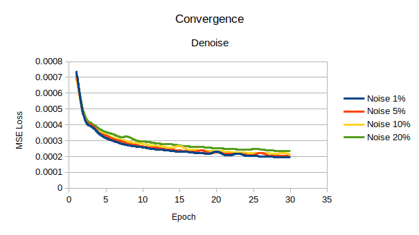
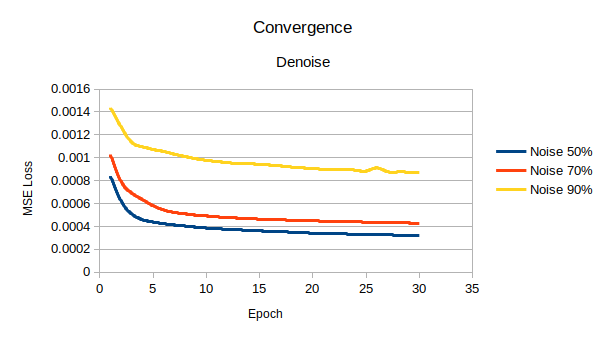
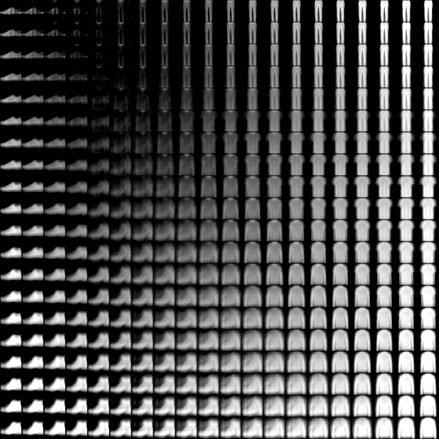

# Introduction

At the beginning, Artificial Neural Networks (ANNs) have been used for supervised learning
tasks however those can be used for unsupervised learning applications. Here, I tackle the 
problem of denoising images via [Autoencoders](https://www.sciencedirect.com/science/article/pii/S0925231216315533)
which are techniques designed to efficiently learn, compress and encode data by compressing
and reconstructing the data back, i.e., from the reduced encoded data representation obtain
a representation as similar to the given input as possible.


This project is then focused on the design and implementation of two autoencoders based on
Artificial Neural Networks (ANNs) the first one to denoise grayscale images and the second for sampling
learned patterns in the latent space. Here, multilayer perceptrons are considered. To do
that, the following condition are imposed:

1. Assume you have a dataset of images pre-processed.
2. Used the given dataset to add controlled salt-and-pepper noise with different probability
   (0.01, 0.05, 0.1 and 0.2).
3. Propose an autoencoder for denoising data:
    - Input: Original data.
    - Output: Respective corrupted data.
4. Discuss if the encoder is able to solve the problem.


A second experimentation is for sampling latent variables of a proposed autoencoder and
observe which patterns the autoencoder can learns.

{ width=100% #fig:janet}


Following section is used to solve an interesting problem about encode grayscale images corrupted
by salt-and-pepper noise.

# Methodology

Here a multilayer-perceptron-based autoencoder is proposed such that the amount of latent variables (compression level) can be handled by a user-defined parameter $N$. This autoencoder is then called JANet-$N$. The encoder and the decoder consist on three layers: input, a hidden (activated by the RELU function) and an output layer.

It worth mentioning the output is the results of applying the sigmoid function in order to obtain normalized responses whilst the decoder output is activated by the LeakyRELU. Figure @fig:janet describes the autoencoder.


The optimization method to train the proposed autoencoder is the well-known optimization method called
[ADAM](https://arxiv.org/abs/1412.6980v8) to optimize parameters of ANNs. ADAM requite, at the beginning, one parameter called learning rate. Here, that parameters was fixed to $\eta =1\times 10^{-3}$.
The [Mean Squared Error Loss](https://research.google/pubs/pub38136.pdf) function is considered
for optimization procedure.
The following section is focused on describing the dataset to perform different experiments.

{ width=100%  #fig:fashionmnist}


The database used in this experimentation is known as [Fashion-MNIST](https://www.cs.toronto.edu/~kriz/fashionmnist.html)
dataset that consists of 60000 preprocessed grayscale images (with size $28 \times 28$). Figure @fig:fashionmnist presents some images in this dataset.


# Results and Discussion

JANet-$N$ was implemented in the [Julia Programming Language](https://julialang.org/)
since it is open-source software and provides an extensible  library for machine learning
called [Flux](https://fluxml.ai). The implementation of JANet-$N$ is described as follows:


```julia
encoder = Chain(
    Dense(28^2, 12^2, relu),
    Dense(12^2, N, sigmoid)
) |> gpu

decoder = Chain(
    Dense(N, 12^2, relu),
    Dense(12^2, 28^2, leakyrelu)
) |> gpu 

autoencoder = Chain(encoder, decoder)
```


In this work the 60000 images where used in batches with size 1000. All experiments ran in a PC Intel(R) Core(TM)2 Quad CPU    Q6600  @ 2.40GHz with 7GB RAM and GeForce GTX 1050 Ti 4GB VRAM.


{width=90%  #fig:results1}


Figure @fig:results1 show the result on how JANet-50 learns. It worth noticing that the
proposed autoencoder is able to reduce the noise however the recovered images show poor
quality in comparison with the original images. That is because of JANet-50 compress the
data.

{width=90%  #fig:results2}

{ width=99%  #fig:conva}

{ width=99%  #fig:convb}


{ width=95% #fig:latent}


Figures @fig:conva and @fig:convb shows information about the convergence of JANet-50 with different noise percentage.


