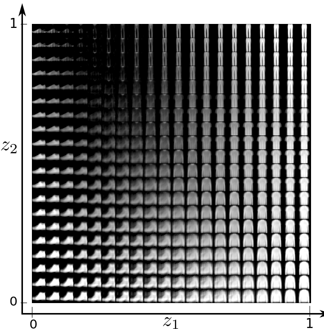

# Introduction

This project is focused on the design and implementation of two autoencoders based on
Artificial Neural Networks (ANNs) one to denoise grayscale images and another for sampling learned patterns in the latent space. Here, multilayer perceptrons are considered.


{ width=95% #fig:janet}

At the beginning, Artificial Neural Networks (ANNs) are used for supervised learning tasks how ever those are also used for unsupervised learning issues. Here, I tackle the 
problem of denoising images via [Autoencoders](https://www.sciencedirect.com/science/article/pii/S0925231216315533) which are techniques designed to efficiently learn, compress and encode data by compressing and reconstructing the data back, i.e., from the reduced encoded data representation obtain a representation as similar to the given input as possible.

Following section is used to solve an interesting problem about encode grayscale images corrupted by salt and pepper noise.

# Design

Here a multilayer-perceptron-based autoencoder is proposed such that the amount of latent variables (compression level) can be handled by a user-defined parameter $N$. This autoencoder is then called JANet-$N$. The encoder and the decoder consist on three layers: input, a hidden (activated by the RELU function) and an output layer.
It worth mentioning the output is the results of applying the sigmoid function in order to obtain normalized responses whilst the decoder output is activated by the LeakyRELU. Figure @fig:janet describes the autoencoder.


The optimization method to train autoencoders was the well-known optimization method called
[ADAM](https://arxiv.org/abs/1412.6980v8), with learning rate fixed to $\eta =1\times 10^{-3}$
and the [Mean Squared Error Loss](https://research.google/pubs/pub38136.pdf) function is considered.
The following section is focused on describing the dataset to perform different experiments.

{ width=99%  #fig:fashionmnist}

## Dataset


The database used here is the [Fashion-MNIST](https://www.cs.toronto.edu/~kriz/fashionmnist.html)
dataset that consists of 60000 images ($28 \times 28$) for the training stage (see Figure @fig:fashionmnist).


# Implementation

JANet-$N$ was implemented in the [Julia Programming Language](https://julialang.org/)
since it is open-source software and provides an extensible  library for machine learning
called [Flux](https://fluxml.ai). The implementation of JANet-$N$ is described as follows:
```julia
encoder = Chain(
    Dense(28^2, 12^2, relu),
    Dense(12^2, N, sigmoid)
) |> gpu

decoder = Chain(
    Dense(N, 12^2, relu),
    Dense(12^2, 28^2, leakyrelu)
) |> gpu 

autoencoder = Chain(encoder, decoder)
```


In this work the 60000 images where used in batches with size 1000. All experiments ran in a PC Intel(R) Core(TM)2 Quad CPU    Q6600  @ 2.40GHz with 7GB RAM and GeForce GTX 1050 Ti 4GB VRAM.


{width=90%  #fig:results1}


{width=90%  #fig:results2}


{ width=95% #fig:latent}


Figures @fig:conva and @fig:convb shows information about the convergence of the JANet 1  and JANet 2, respectively.
The accuracy obtained on the validation set for 100 classes was 50% (JANet1) and 59% (JANet2) in 35 epochs. The [source code](https://github.com/jmejia8/cnn-projects) is available in order to you can replicate those results.

{ width=99%  #fig:conva}
{ width=99%  #fig:conv}


{ width=99%  #fig:convb}


## Transfer Learning

Figure @fig:gg shows how the transfer learning impact the convergence velocity. It can be noted that the knowledge transfer allows rapid convergence
however it can induce that the optimization method finds a local optima.


{ width=99%  #fig:gg}
